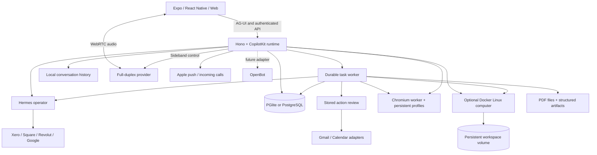

  <div align="center">

# OpenMuse Business OS

An owner-operated fork of [CopilotKit/OpenMuse](https://github.com/CopilotKit/openmuse), pinned at `bb7ce4e1c6e523bf282a655c63621e3ed9e75150`. The shipped clients retain the upstream Expo interface, components and navigation. Mac access uses the web app.

Business additions use self-hosted PostgreSQL, Hermes, direct business APIs, local conversation storage, native iOS calling and direct APNs. [Deployment and acceptance status](docs/BUSINESS-OS.md) · [Connections](docs/BUSINESS-CONNECTORS.md) · [Backups](docs/BACKUP-RESTORE.md).

**A personal agent with a browser, terminal, files, and work that keeps going. Compatible with any agent harness.**

Ask for an outcome. Follow the plan, review actions, and come back to the result.
Built with CopilotKit React Native for iOS, Android, and web.

[Quick start](#quick-start) · [Demo](#demo) · [Features](#features) · [Architecture](#architecture) · [Docs](docs/README.md) · [Contributing](CONTRIBUTING.md)

[](https://github.com/joshbilson/openmuse-business-os/actions/workflows/ci.yml)
[](LICENSE)

Clone this template and customize it however you want.

**[Building on OpenMuse? Meet with the CopilotKit team →](https://www.copilotkit.ai/openmuse)**

[](assets/demos/2026-09-16/mobile.mp4)

**[Watch the mobile demo · 38 seconds](assets/demos/2026-09-16/mobile.mp4)**

[](assets/demos/2026-09-16/web.mp4)

**[Watch the web demo · 42 seconds](assets/demos/2026-09-16/web.mp4)**

</div>

> **Alpha, for self-hosting and building on.** Open-ended reasoning, live Google accounts, and provider access require their own configuration. See [what is verified](docs/VERIFICATION.md) and the [roadmap](ROADMAP.md).

## Demo

On iPhone, ask OpenMuse to find interesting stories on Hacker News and summarize CopilotKit. On desktop, ask it to check the school-trip email, open the message, and research exhibits at Monterey Bay Aquarium. The agent shows email and browser results inline. **Take control** opens that same browser session when you need it.

The 38-second iPhone and 42-second desktop web demos show the current interface, framed in 16:9. The send arrow becomes a stop square inside the input pill while the agent replies, then switches back. Stopping keeps your draft intact. See the [recording notes](docs/DEMO.md) for the model setup and reproduction steps.

[Mobile MP4](assets/demos/2026-09-16/mobile.mp4) · [Web MP4](assets/demos/2026-09-16/web.mp4) · [Recording details and reproduction](docs/DEMO.md)

## What it is

OpenMuse is a personal-agent application with an agent computer, visible work, and rich results. It runs its own server, task worker, and browser worker. You can inspect and change the source under the MIT license.

The computer combines **persistent Chromium and an optional Linux workspace**. The agent can browse public pages, run commands in its own container, work with files, and move PDFs between the computer and the app. You can open its browser or terminal and continue the work. Graphical desktops and autonomous checkout remain future work.

## Features

| Surface | What runs in this alpha |
| --- | --- |
| **Chat** | CopilotKit headless chat with streamed AG-UI events, mailbox search and reading, send/stop in one input pill, a visible follow-up queue, retained drafts, delegated tasks, and inline email, browser, PDF, plan, and finance cards. |
| **Agent computer** | Persistent browser profiles and takeover console; optional isolated Linux terminal, saved command receipts, editable workspace files, and PDF transfer. |
| **Activity** | Durable task plans, progress, input requests, pause/resume/cancel/retry, approvals, and saved receipts. SQL leases recover interrupted work. |
| **Ideas** | Suggestions with source evidence; edit, accept, or dismiss. Sent replies and completed matching work are excluded. |
| **Goals & Tracking** | Goals and milestones; recurring public-page checks for changes, text availability, or USD price thresholds, with deduplicated alerts and failure backoff. |
| **Documents** | Email attachment → PDF → requested form values → filled copy → reviewed reply → receipt. Native/web PDF viewing, paging, zoom, supported fields, and sharing. |
| **Finance** | Import transaction CSV to create a spending summary with categories, transactions, and a savings-goal action. |
| **Gmail & Calendar** | Google OAuth adapters, complete mail threads, drafts/attachments, calendar discovery, and reviewed event creation/update/deletion. Live credentials required. |
| **Personal context** | Editable name, tone, avatar, and memories. Background-update preferences and durable in-app notifications. |
| **Rich Threads** | Local PostgreSQL persistence, with a stable main conversation, side chats, renaming, archiving, restoring, and replay. Text and voice share the same history. |
| **Business views** | Hermes selects cards or tables from verified source records; immutable snapshots retain exact amount strings, account identity, evidence and observation dates inside Apps. |

The [feature inventory](docs/FEATURES.md) describes implemented capabilities and planned extensions. This fork adds direct business connectors, iOS push and full-duplex calling. Hardware and account-dependent acceptance is recorded in [BUSINESS-OS.md](docs/BUSINESS-OS.md); upstream future features remain in the [roadmap](ROADMAP.md).

## Quick start

**Requirements:** Node 24 LTS and pnpm 11.19.0. The local sample app needs no model, Google account, or Docker.

```sh
git clone https://github.com/joshbilson/openmuse-business-os.git openmuse
cd openmuse
pnpm install --frozen-lockfile
cp .env.example .env
pnpm dev
```

In another terminal:

```sh
pnpm dev:web
```

Open [localhost:8081](http://localhost:8081). The API runs at [localhost:8787/api/health](http://localhost:8787/api/health).

### Try it

1. In Chat, send **“Complete the permission slip”**. Open the task, supply fictional form values, inspect the saved PDF, and review the prepared reply. This writes only to the local mailbox.
2. In **Goals → Track**, create a built-in availability watch, then change the built-in test page to trigger an alert.
3. In **Menu → Delegate task → Finance**, use **Try example transactions** to create an interactive spending tracker.
4. Start the [browser worker](#browser-worker) and configure a model, then ask **“Check out Hacker News for cool stuff”** or **“Summarize copilotkit.ai”**. Follow the browser inline and use **Take control** to open its session. For a model-free version of this flow, follow the [AI Mock demo setup](docs/DEMO.md#run-the-agent-browser-demo).

For iOS or Android, use `pnpm --dir apps/mobile ios` or `pnpm --dir apps/mobile android`. Xcode or Android tooling is required. The PDF reader needs an Expo development build; use [native setup](apps/mobile/README.md).

## Configure the agent and Google

Copy the commented settings in [.env.example](.env.example) into your private `.env`:

1. Configure a private Hermes API and set `AGENT_BACKEND=hermes`, `HERMES_API_URL`, `HERMES_API_KEY`, `HERMES_PROVIDER` and `HERMES_MODEL`. Model providers are selected through Hermes; an unconfigured or different runtime fails explicitly.
2. Set `WORKSPACE_MODE=live`, `DATABASE_URL`, a random `OPENMUSE_ACCESS_KEY` of at least 24 characters, and `TOKEN_ENCRYPTION_KEY` containing 32 random bytes encoded as base64.
3. Configure a Google OAuth web client with Gmail and Calendar APIs enabled. Register `${PUBLIC_API_URL}/api/google/callback`, then set `GOOGLE_CLIENT_ID` and `GOOGLE_CLIENT_SECRET` on Oracle.
4. Open **Apps** for business connections. Account identity is verified using each provider. Credentials remain on Oracle.
5. `ACTION_APPROVAL_MODE=standing-authority` records authorization from the owner's standing policy. External actions use durable claims and receipts; uncertain outcomes are never automatically retried.

Google credentials are encrypted at rest. File URLs and browser consoles use short-lived signatures. This deployment uses one owner protected by a shared access key; it is not a multi-tenant authentication system. Use HTTPS and restricted network access for a remote host. Keep the default local-data mode on loopback.

## Browser worker

Set `BROWSER_WORKER_URL=http://127.0.0.1:8790` and a random `WORKER_TOKEN` of at least 32 characters in `.env`.

```sh
pnpm --dir apps/worker exec playwright install chromium
pnpm dev:browser
```

Or use `docker compose --env-file .env -f infra/compose.yaml up --build -d`. The same token must reach the API and worker. Sessions have persistent Chromium profiles; the app can open a live screenshot console and import PDF downloads. Agent tools can read public pages and hand interactive work to the person. [Worker setup and boundaries](apps/worker/README.md).

## Persistence and operation

### Linux terminal and workspace

Build the computer image, enable it on the API, then open **Computer → Terminal → Start computer**:

```sh
docker build -t openmuse-computer:local apps/computer
COMPUTER_ENABLED=true pnpm dev
```

The API needs access to the Docker CLI and engine. Commands run in a nonroot container with no host-directory mounts or credentials. A named `/workspace` volume retains files when stopped. Terminal networking is disabled; public web access uses the browser worker. Commands have a 30-second limit and saved output/exit receipts. **Files** supports folders, text editing, and PDF transfer to/from Documents. This is a Linux container, not a full operating-system VM. [Setup, Colima option, and boundaries](docs/COMPUTER.md).

### Application storage

By default, embedded PGlite, documents and the signing key live in `.openmuse/`; browser profiles live in `.openmuse/browser-profiles/`. Keep that directory private and back it up. The API hosts the task worker. The host must remain running for background work.

For a separate task worker, configure the same `DATABASE_URL`, secrets and shared `DATA_DIR` for both processes, then set `TASK_WORKER_ENABLED=false` on the API and run `pnpm dev:worker`. PGlite cannot be opened by separate processes. Production commands are `pnpm build:server`, `pnpm start` and `pnpm start:worker`. Run one API instance; task workers coordinate through SQL leases.

No hidden retry occurs after an uncertain external write. Review its provider outcome before creating a replacement. Pausing/cancelling prevents subsequent task steps; an already approved in-flight provider request may finish.

## Local conversations

The original CopilotKit chat interface uses an owner-scoped local AG-UI adapter. Conversations, message history and run events persist in PostgreSQL on Oracle. There is no required hosted Intelligence service or Intelligence project key. Hermes runs have idempotency keys and can be reconciled after reconnecting. [Persistence contract](docs/RICH-THREADS.md).

## Architecture



| Directory | Purpose |
| --- | --- |
| `apps/mobile` | Shared iOS, Android, and web UI with CopilotKit headless hooks. |
| `apps/server` | API, CopilotKit runtime, identity boundary, task engine, reviews, files, and persistence. |
| `apps/worker` | Token-protected Playwright browser service with persistent profiles. |
| `apps/computer` | Nonroot Linux image, bounded filesystem helper, and real container verification. |
| `packages/domain` | Shared types and request validation. |
| `packages/integrations` | Google and browser protocol adapters. |
| `packages/backends` | Optional OpenBot HTTP adapter and its identity boundary. |
| `tests` | Workflow, runtime, persistence, provider-contract, and authorization tests. |

### OpenBot compatibility

OpenMuse's native client and personal-agent workflows are independent of OpenBot. The disabled OpenBot adapter is pinned and contract-tested against upstream interfaces. Live user/session bridging, routine mapping, and computer backend wiring remain future work. OpenBot's Intelligence runtime is not a raw AG-UI endpoint. [Integration contract](docs/OPENBOT-INTEGRATION.md).

## Development

```sh
pnpm lint
pnpm typecheck
pnpm test
pnpm build:server
pnpm build:web
pnpm build:ios
pnpm build:android
pnpm --dir apps/worker typecheck
pnpm test:browser
pnpm test:computer
```

Platform build scripts export JavaScript/Hermes bundles; they do not produce signed app binaries. Browser checks require installed Chromium and public fixture access. CI also exercises the browser and Linux computer containers. See [contribution guidance](CONTRIBUTING.md) and [verification results](docs/VERIFICATION.md).

## Contributing and license

Issues and pull requests are welcome. Start with [CONTRIBUTING.md](CONTRIBUTING.md), [ROADMAP.md](ROADMAP.md), and the [security policy](SECURITY.md).

MIT licensed. Built by CopilotKit. Its original interface and fictional assets are included. Website, email, and document content supplies evidence, not permission to act.
